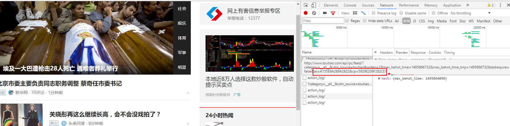
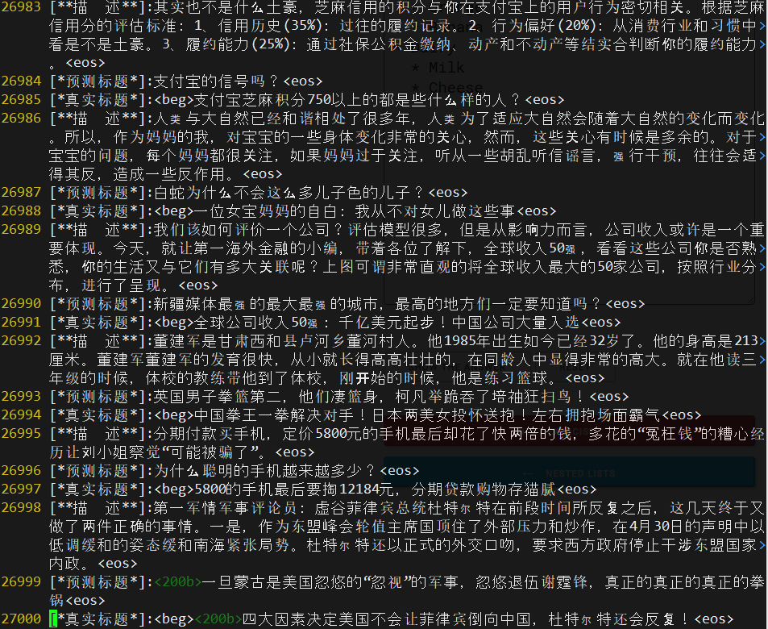
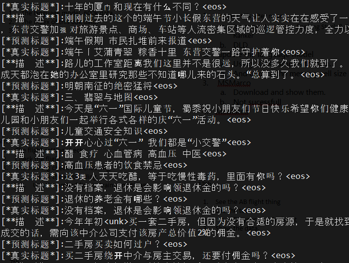
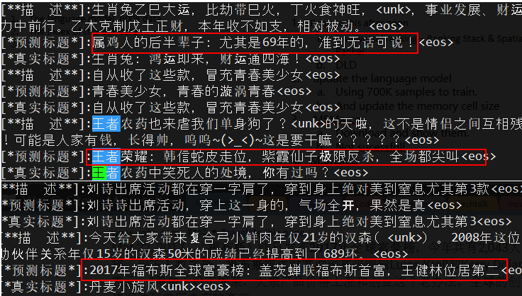

# DianJing
点睛 - 头条号文章标题生成工具

1. 功能：
    自动为头条的文章生成一个题目候选列表(Automatically Generate Article Title in TouTiao Style)
2. 展现形式：
    初期是linux 的客户端，后期开发一个前端页面，或者一个chrome 插件的形式存在。
3. 主要技术：
    使用encoder-decoder的技术对 头条的 摘要 和 文章对(abstract-title pair)标题进行训练
4. 数据来源：
    主要使用 头条的 数据接口，抓万级别的训练样本。

## 数据使用和爬取  Data Usage and Crawl
1. 可用的训练数据，`./data/basic_data_80k_v2.pkl.tgz` 包含了约61K的(abstract, title)数据。通过tar -xzvf basic_data_80k_v2.pkl.tgz 解压之后，可以使用 `./scripts` 下的 data_utils.py 来check 数据数量和展示sample的样本。
2. 另有一份large data set 包含 700k左右的training 样本， 将稍候公开 （ETA Mar. 2018）。
3. 使用 `./scripts/crawl.py` 来爬取头条数据，但是需要指定头条feed 流中的 as 和 cp 两个参数，这两个参数，最好每三天更新一次，获取方法如下
   从chrom 浏览器的 network 中可以看到最新feed 流地址的这两个参数
   

## 实验日志 Experiment Log 
1. 2017/05/27  使用大约30K的训练样本，摘要-标题对，对每个汉字做100 维 embeding 使用CNN做encoder，GRU unit 的RNN 做decoer. 一天500个epoch 之后训练效果如下 ：
    * 
    * 分析：
        * 基本可以分析出描述中的关键语义
        * 但是语言可读性较差
    * 改进方向
        * 训练样本可能不足
        * 基于中文分词做，不是汉字粒度
        * LSTM 在生成长文本上的能力并不好，可以考虑基于大量语料库的language model
2. 2017/06/01 
    * 提升：
        * 使用search api 爬去了8000(dict/keywords.select)关键字的600K 文章
        * 使用jieba 进行分词，进行
        * 在30K 训练样本上的语言可读性提高
    * 问题：
        * 在600K 数据上OOV 问题严重，模型难以收敛
    * 解决：
        * 增大vocabulary size
        * 先训练rnn 的language model，能说好话
        * 然后是基于condition的条件下说话
3. 2017/06/20 
    * 
    * 这预测标题写的，以假乱真，不去查一下，还真的被他骗了
    * 
    * 分析：
        * 增大vacobulary size 到 212K
        * pre-train rnn 的decoder，然后标题可读性大大提升
        * 700k 的training samples， 对语义的理解准确性提升
    * 提升：
        * 调低learning rate 和 batch_size 增加探索能力
        * 考虑如何解决 OOV  的问题
        * 主要是push 当前的 search，abstract-embedding，AI，三个版本上线
        
